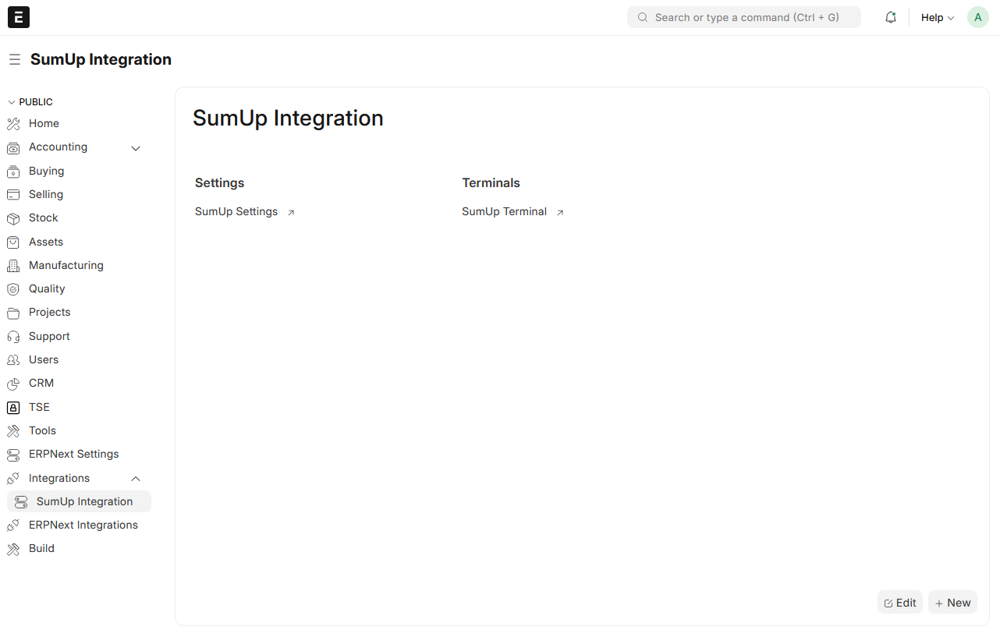
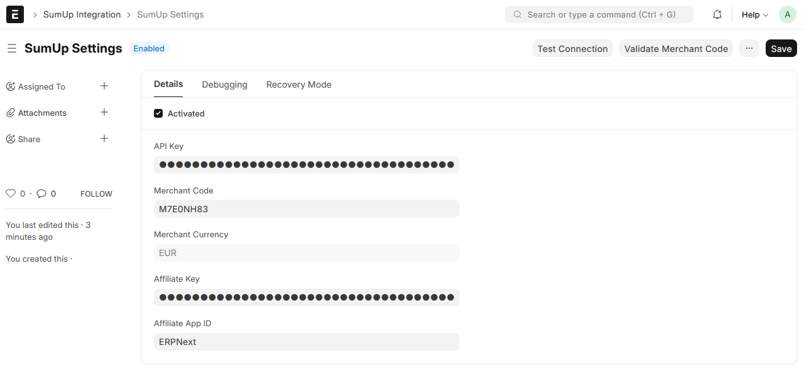
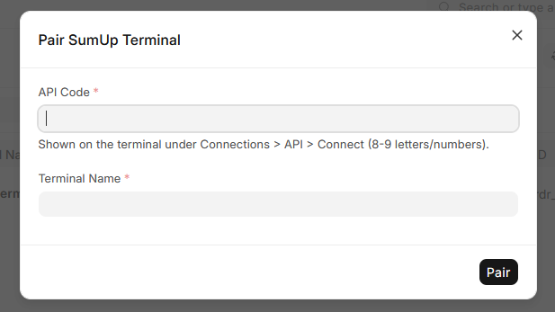
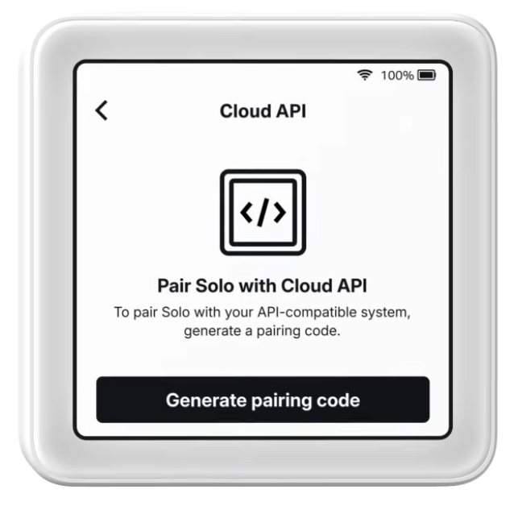
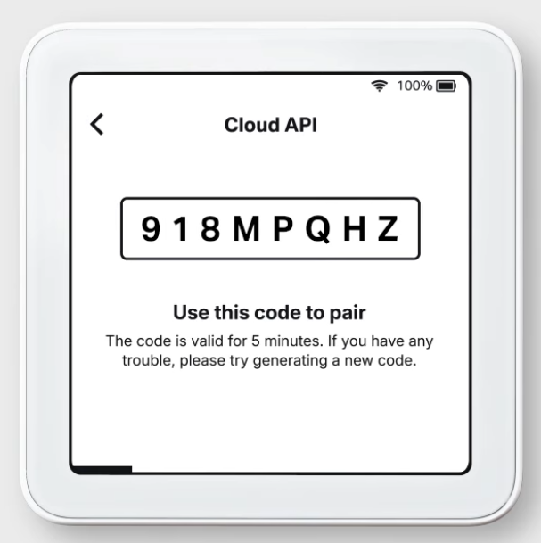
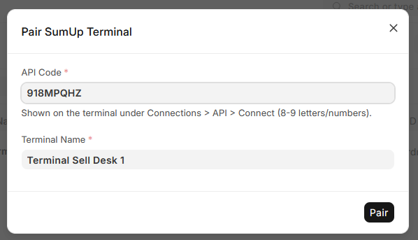
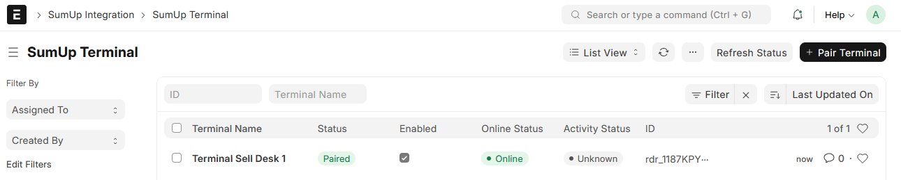
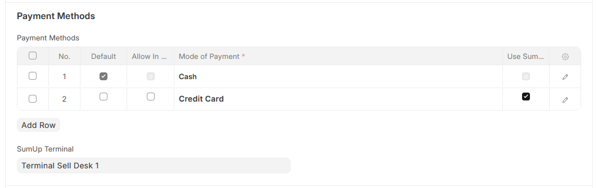
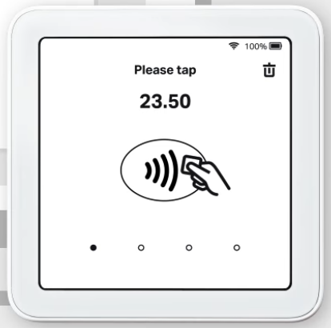

<div align="center">
  <p>
    
  </p>
    <h1>SumUp ERPNext Integration</h1>
</div>

This app integrates [SumUp](https://www.sumup.com) card terminals into ERPNext and allows card payments directly in the POS.

When a card payment is selected, the amount is sent to a SumUp terminal. After successful payment, the result is sent back to ERPNext and the POS sale is completed.
In the event of a refund or return, the amount will also be automatically refunded for any previous SumUp payments.

> **Trademark notice:**
> SumUp is a registered trademark of SumUp Payments Limited.
> This project is not affiliated with SumUp.

## Supported Versions

| ERPNext | Frappe | Support Status |
|---------|--------|----------------|
| v16 Beta | v16 Beta | Testing... |
| v15 | v15 | ✅ Supported  |

## Installation (Frappe Cloud)

The app can be installed directly via Frappe Cloud:

1. Open the Frappe Cloud dashboard at <https://frappecloud.com/dashboard/#/sites>
2. Click **"New Site"** to create a new site
3. In the step **"Select apps to install"**:
   - Choose the desired Frappe/ERPNext version
   - Enable the app **`ERPNext SumUp`**
4. Complete the wizard to create the site

## Installation (Self-Hosted)

Once ERPNext is installed, add the app to your bench environment:

```bash
bench get-app https://github.com/Rocket-Quack/erpnext_sumup.git --branch version-15
```

Install requirements:

```bash
bench setup requirements
```

Install the app on a site:

```bash
bench --site yoursite.com install-app erpnext_sumup
```

Run migrations:

```bash
bench --site yoursite.com migrate
```

## Configuration

1. After installation, open the **SumUp Integration**
   <p>
   
   </p>
2. Open **SumUp Settings**:
   - Enable SumUp
   - Enter **API Key**, **Merchant Code** and **Affiliate Key**
   - Click **Test Connection** to fetch the merchant currency
   - (Optional) Click Validate Merchant Code to verify correct keys and merchant
   <p>
   
   </p>
3. Pair a terminal:
   - Go to **SumUp Terminal** list
   - Click **Pair Terminal**
   <p>
   
   </p>
   - Start the SumUp Solo device and select **Cloud API** as the connection
   <p>
   
   </p>
   - Generate a pairing code
   <p>
   
   </p>
   - Enter the pairing code shown on the terminal and a name for the terminal to be used for administration purposes
   <p>
   
   </p>
   - After successful connection, the terminal is listed. If necessary, the status can be updated manually using the Refresh Status button. The status is automatically updated at regular intervals.
   <p>
   
   </p>
4. Mark a payment method for SumUp and assign the terminal:
   - Open **POS Profile**
   - Select the payment method you want to use with SumUp (Checkbox)
   - Set the **SumUp Terminal** to be used for the POS profile
   <p>
   
   </p>
5. Use in POS:
   - As soon as a payment for SumUp has been selected, the workflows are triggered and the payment is forwarded to the terminal. If the payment is successful, the POS invoice is submitted directly.
   <p>
   
   </p>

Notes:
- [SumUp Solo Cloud API](https://www.youtube.com/watch?v=AhI6R0RLtDw) How-to video on YouTube
- SumUp payments must cover the full invoice total.
- The POS invoice currency must match the SumUp merchant currency.

## More Instructions

More detailed instructions can be found here: 
- [Payment Process](/docs/guides/payment-process.md)
- [Recovery Mode](/docs/guides/recovery-mode.md)
- [Refund Flow](/docs/guides/refund-flow.md)

## Community Support

Please create a ticket via [Issues](https://github.com/Rocket-Quack/erpnext_sumup/issues) for:

- **Bug Reports & Feature Requests** 
- **Questions about general use**

## Sponsors ❤️

Development and maintenance are made possible by sponsors and voluntary support. 

If you would like to support the project, you are welcome to do so via [Ko-fi](https://ko-fi.com/rocketquack).

## Trademark Notice

**SumUp** is a registered trademark of **SumUp Payments Limited**.

This project is an independent and unofficial integration and is not affiliated with SumUp.
It is not operated, supported, or endorsed by SumUp.

The name SumUp is used only to describe technical compatibility with the respective services.

## Third-Party

This app uses the Python package `sumup` v0.0.20 (tag v0.0.20). See `THIRD_PARTY_NOTICE.md`.

## License

Copyright (C) 2026 RocketQuackIT

This program is free software: you can redistribute it and/or modify it under the terms of the GNU General Public License as published by the Free Software Foundation, either version 3 of the License, or (at your option) any later version.

This program is distributed in the hope that it will be useful, but WITHOUT ANY WARRANTY; without even the implied warranty of MERCHANTABILITY or FITNESS FOR A PARTICULAR PURPOSE. See the GNU General Public License for more details.

GNU GPL V3. See the LICENSE file for more information.
