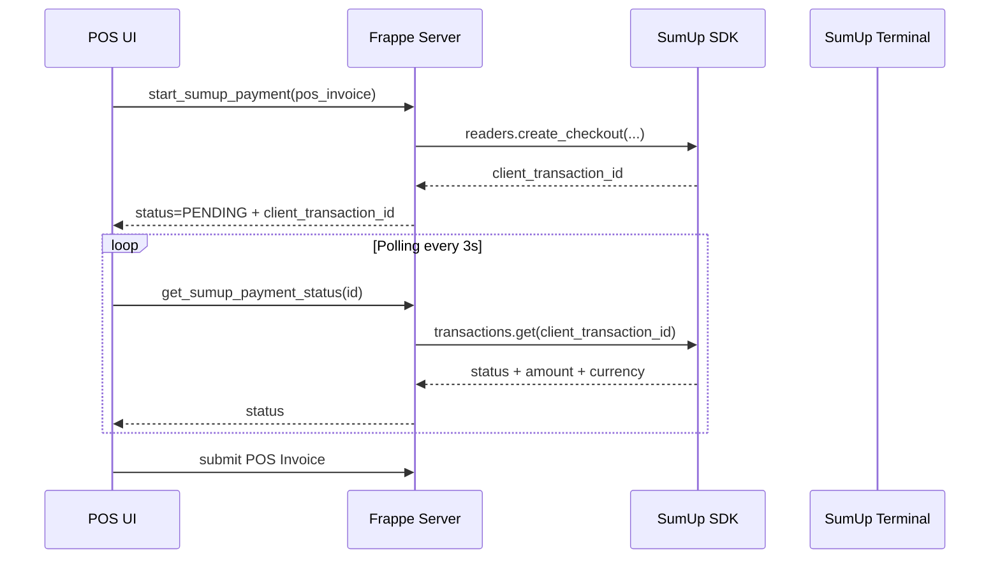
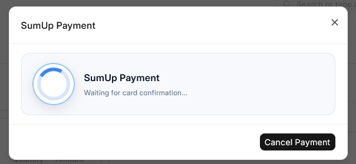
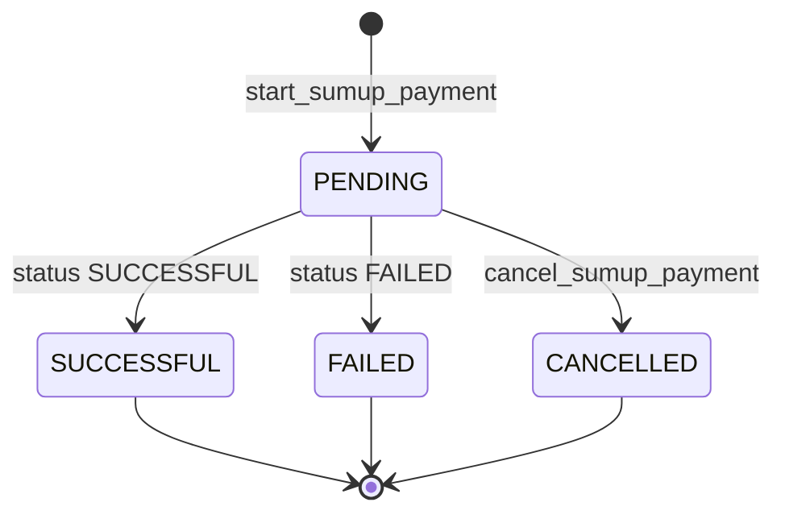

# SumUp Payment Process (POS)

This document describes the payment process of the SumUp integration in ERPNext (POS), including flow diagrams and key validations.

## Components

- POS UI (JavaScript in ERPNext)
- Frappe backend (whitelisted methods)
- SumUp SDK (calls SumUp API)
- SumUp terminal (card reader)
- Data objects: POS Invoice, POS Profile, SumUp Settings, SumUp Terminal

## Prerequisites

- SumUp Settings are enabled and contain API Key and Merchant Code.
- Merchant Currency is set (via Test Connection).
- POS Payment Method is marked with "Use SumUp Terminal".
- POS Profile points to an enabled SumUp Terminal.
- POS Invoice currency matches the Merchant Currency.
- The SumUp payment covers the full total (no split with other methods).

## Process Flow (Happy Path)

## POS UI Screenshot

When the dialog appears, the SumUp terminal should display the same amount for confirmation. If the terminal does not show the amount, check the terminal connection status and the POS payment method configuration.

## Status Diagram (SumUp Status)

## Validations and Failures

- POS Profile validation: If a payment method uses SumUp, an active terminal is required.
- POS Invoice validation:
  - Only one SumUp payment method can be used.
  - SumUp payment must cover the full invoice total.
  - Currency must match the merchant currency.
  - Before submit, `sumup_status == SUCCESSFUL` and a transaction ID must exist.
- Cancellation:
  - Users can cancel the payment dialog; status is set to CANCELLED.
  - SumUp API errors are raised as validation errors.

## Data Flow and Fields

Custom fields (created in `erpnext_sumup/install.py`):

- POS Profile: `sumup_terminal` (Link to SumUp Terminal)
- POS Payment Method: `use_sumup_terminal` (Check)
- POS Invoice:
  - `sumup_status` (PENDING/SUCCESSFUL/FAILED/CANCELLED)
  - `sumup_client_transaction_id`
  - `sumup_amount`
  - `sumup_currency`

## Relevant Code Paths

- POS backend flow: `erpnext_sumup/erpnext_sumup/pos/pos_invoice.py`
- POS UI flow: `erpnext_sumup/public/js/pos_invoice_sumup.js`
- Terminal management: `erpnext_sumup/erpnext_sumup/doctype/sumup_terminal/sumup_terminal.py`
- Settings and validation: `erpnext_sumup/erpnext_sumup/doctype/sumup_settings/sumup_settings.py`
